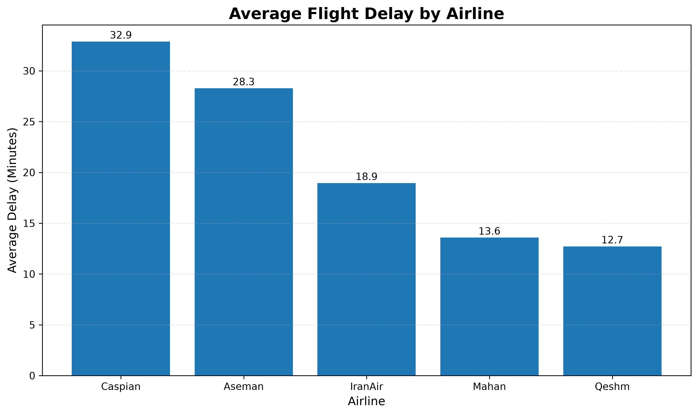
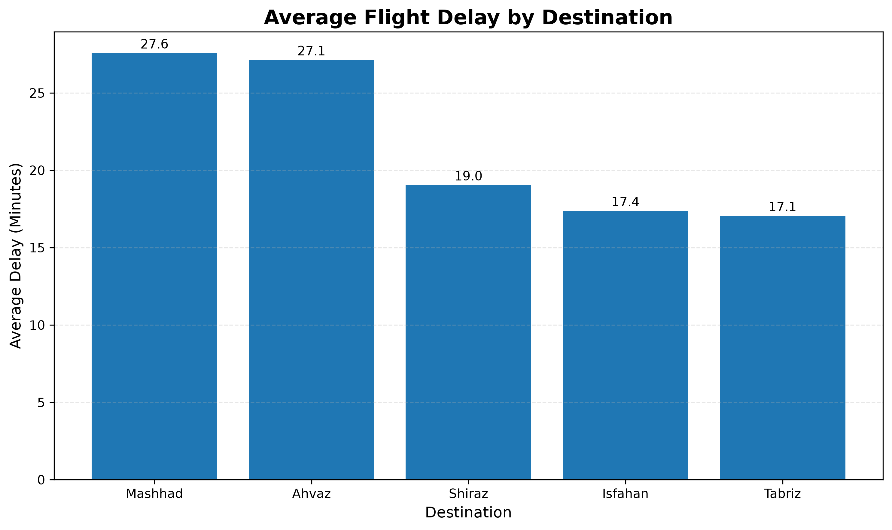
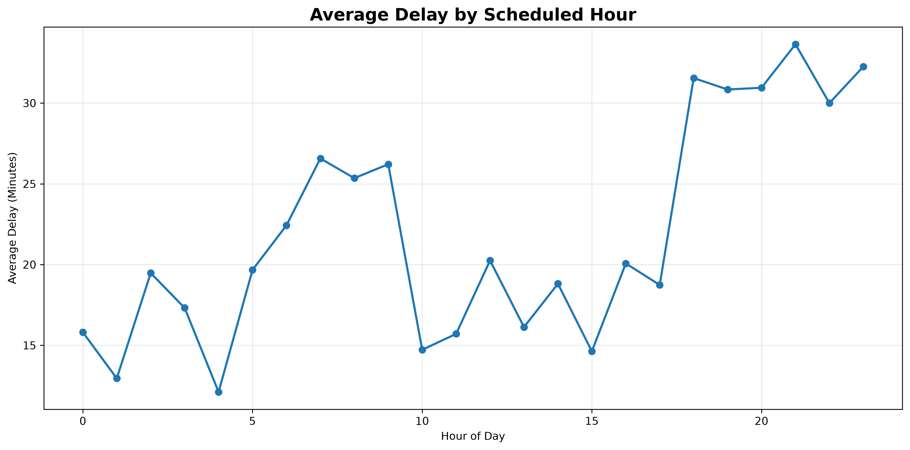
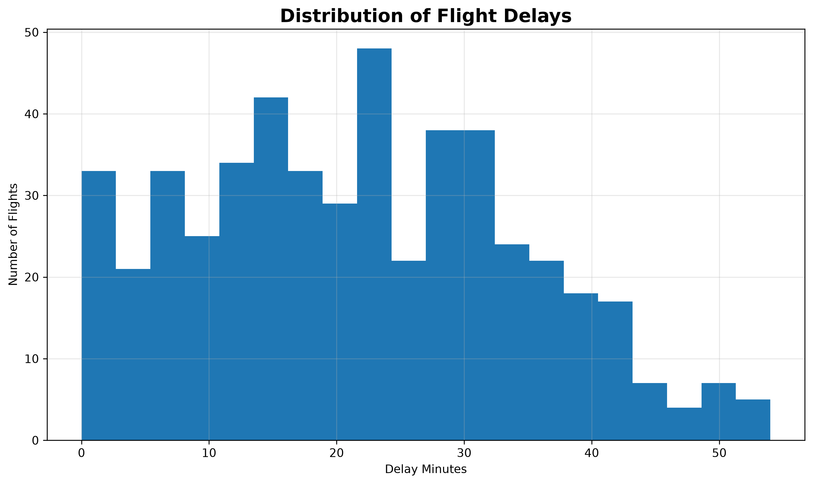
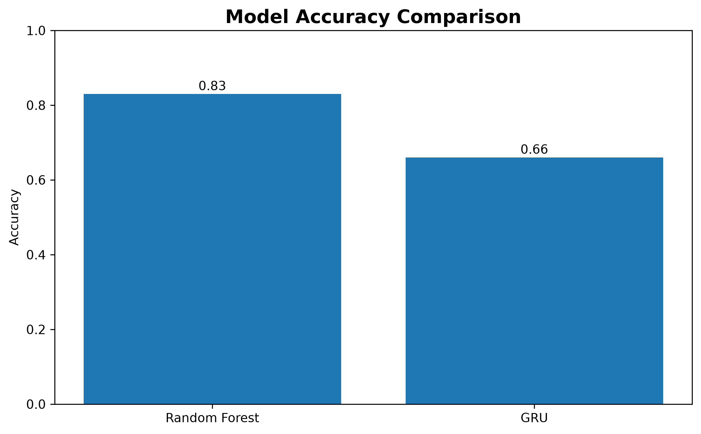
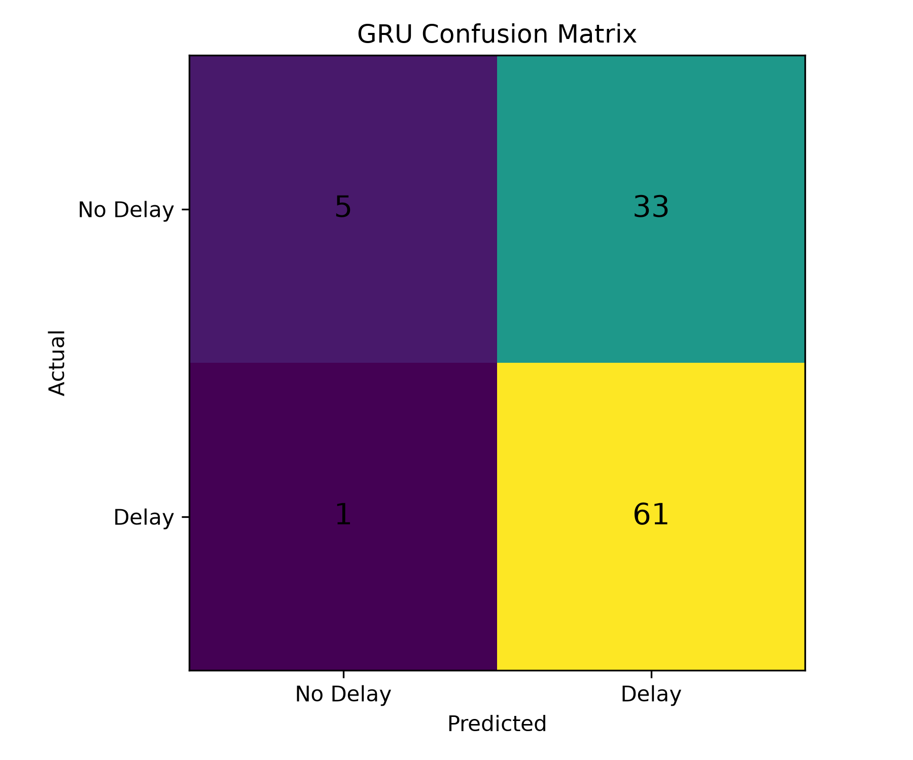
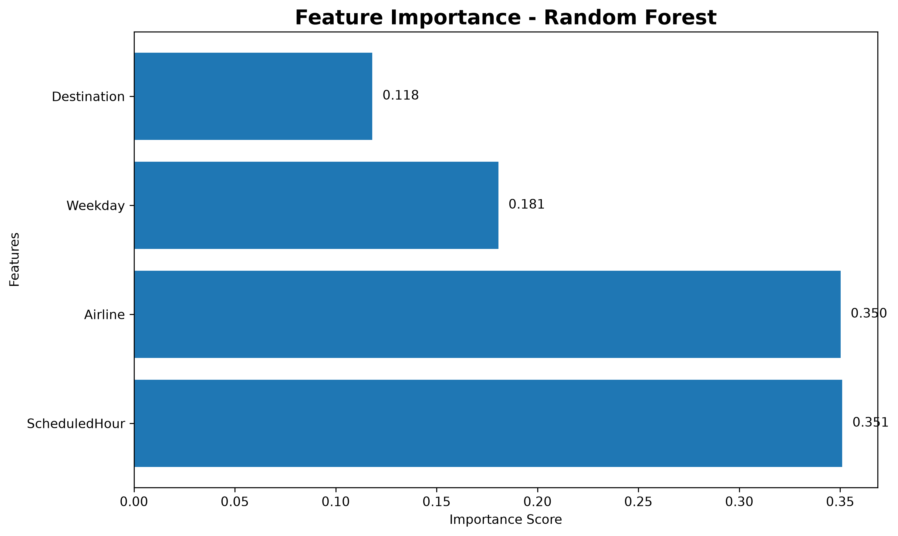

# ✈️ Mehrabad Flight Delay Prediction

A machine learning and deep learning project for predicting flight delays using a synthetic dataset inspired by Mehrabad Airport operations.

## 📌 Project Overview

This project analyzes flight delay patterns and predicts whether a flight will be delayed based on operational factors such as:

* Airline
* Destination
* Day of Week
* Scheduled Departure Hour

The project includes:

* Dataset Generation
* Exploratory Data Analysis (EDA)
* Data Visualization
* GRU-based Deep Learning Model
* Model Evaluation

---

## 📂 Project Structure

```text
mehrabad-flight-delay/
│
├── generate_dataset.py
├── gru_model.py
├── evaluate_model.py
├── eda.py
├── mehrabad_flights.csv
├── gru_delay_model.h5
│
├── delay_by_airline.png
├── delay_by_destination.png
├── delay_by_hour.png
├── delay_distribution.png
│
└── README.md
```

---

## 📊 Exploratory Data Analysis

### Average Delay by Airline



### Average Delay by Destination



### Average Delay by Scheduled Hour



### Delay Distribution



---

## 🤖 Deep Learning Model

The project uses a GRU (Gated Recurrent Unit) neural network implemented with TensorFlow/Keras.

### Features

* Airline
* Destination
* Weekday
* Scheduled Hour

### Target

* Delayed (0 = No Delay, 1 = Delay)

---

## 🔧 Technologies Used

* Python
* Pandas
* NumPy
* Matplotlib
* Scikit-learn
* TensorFlow / Keras

---

## 📈 Model Evaluation

The GRU model was trained and evaluated on the generated dataset.

Current performance:

* Accuracy ≈ 66%

This project is intended as an educational demonstration of machine learning workflows including data generation, preprocessing, visualization, model training, and evaluation.

---
## Model Comparison



Comparison between GRU and Random Forest classifiers on the generated dataset.

## Confusion Matrix




-## 📊 Model Comparison

Two machine learning approaches were evaluated on the generated flight delay dataset.

| Model | Accuracy |
|---------|---------|
| GRU (Deep Learning) | 66% |
| Random Forest | 81% |

## 🔍 Feature Importance Analysis

The Random Forest model provides insight into which factors have the greatest impact on flight delay prediction.

### Feature Importance Ranking



### Key Insights

- ScheduledHour was the most important feature (35.1%)
- Airline had nearly identical importance (35.0%)
- Weekday contributed moderately (18.1%)
- Destination showed the lowest impact (11.8%)

These findings suggest that departure time and airline-specific operational characteristics are the primary drivers of flight delays in the generated dataset.


### Key Finding

Although GRU is a powerful deep learning architecture, Random Forest achieved significantly better performance on this structured tabular dataset.

This demonstrates the importance of selecting models based on data characteristics rather than model complexity.

## 👩‍💻 Author

Neda Gilanian

Computer Engineering 

Interested in Data Analysis, Machine Learning, Deep Learning, and Backend Development.
